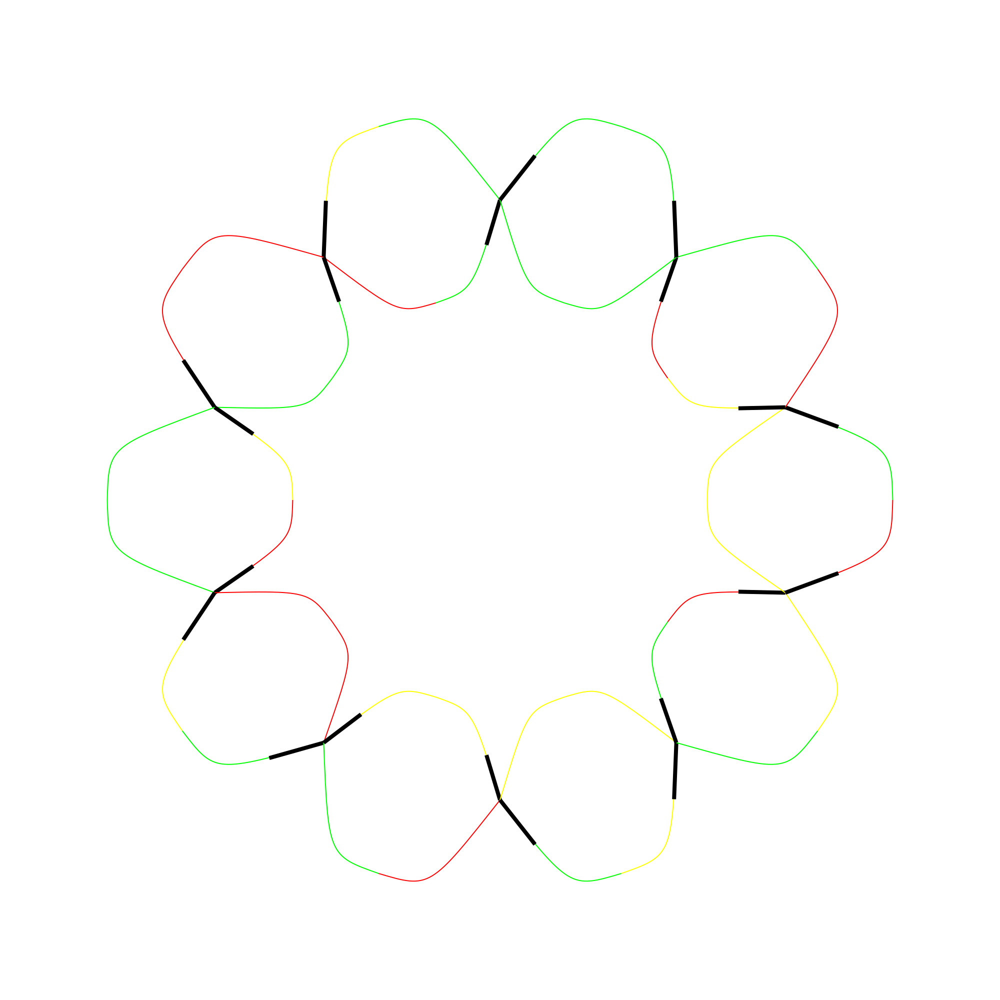

# longroad-envs

Scalable Multi Agent Environment abstractly based on traffic control. This environment is simple but good for debugging large scale multi-agent reinforcement algorithms. The current state is mostly for review only as used in my thesis.

## Environment
Three different environment interfaces are aviable in python
1. IntegerRoadEnv a gym environment
2. IntegerRoadRaw a gymless environment
3. ZooIntegerRoadEnv a pettingzoo multi agent environment

The observation is a integer array which gives the cars for a given node.
The action is an array of 1 or 0 that enables/disables transition for a two given pairs of nodes.
The local reward is a real number for each node which consist of a local term as penalty for halted vehicles and some adjustable global reguliztation terms. 

## TODOS:
- Add rendering functionality
- Add continous control version
